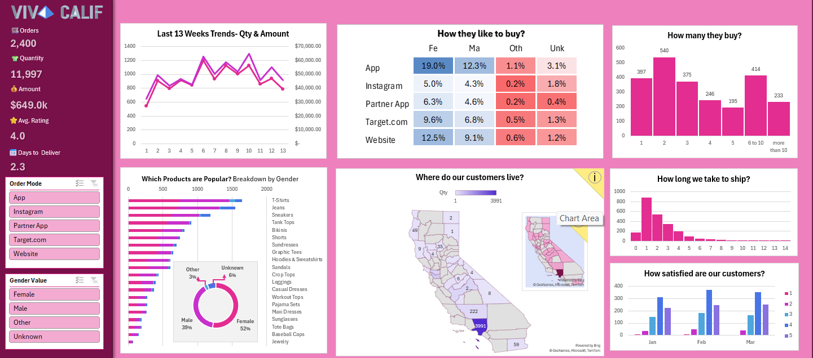

# e-commerce_dashboard

## 📌 Overview

This project presents an interactive **E-Commerce Dashboard built entirely in Microsoft Excel**. It focuses on analyzing customer purchasing behavior, product performance, and operational metrics such as order trends and delivery time.

The dashboard provides clear insights into **what customers buy, how they buy, and where they buy from**, helping businesses understand key drivers of sales and customer satisfaction.

---

## 🎯 Objective

* To analyze customer purchasing patterns and product demand
* To identify top-selling products and categories
* To evaluate order quantity and revenue trends
* To compare shopping behavior across gender
* To analyze order and shipment performance
* To understand customer distribution by location
* To measure customer satisfaction using ratings

---

## 📂 Dataset

The dataset contains e-commerce transaction data including:

* Order details (Order ID, Order Date, Shipment Date)
* Product information (Category, Product Name)
* Quantity and Sales Amount
* Customer demographics (Gender)
* Purchase channels (App, Website, Instagram, etc.)
* Location data (Country, City)
* Customer ratings

- <a href="">Dataset</a>

---

## 🛠️ Tools & Technologies

* **Microsoft Excel**

  * Pivot Tables
  * Pivot Charts
  * Slicers & Filters
  * KPI Cards
  * Dashboard Design

---

## 📊 Dashboard Preview

Below is a visual representation of the Excel dashboard highlighting key insights such as sales trends, product performance, customer behavior, and delivery metrics.

---

## 📊 Key Performance Indicators (KPIs)

* Total Orders
* Total Quantity
* Total Amount
* Average Rating
* Average Days to Deliver

---

## 📈 Dashboard Insights

### 📅 Trend Analysis

* Sales and order trends over the last 13 weeks

### 🛍️ Customer Purchase Behavior

* Preferred purchasing platforms (App, Website, Instagram, etc.)
* Number of items purchased per order

### 📦 Product Analysis

* Most popular products by gender
* Category-wise quantity and revenue

### 👥 Customer Segmentation

* Gender-wise distribution of customers
* Male vs Female purchasing behavior

### 🌍 Location Analysis

* Orders by country and city
* Regions with highest customer activity

### 🚚 Delivery Performance

* Shipping time distribution
* Average days taken to deliver orders

### ⭐ Customer Satisfaction

* Customer ratings analysis over time

---

## 🚀 Conclusion

This project demonstrates how Excel can be effectively used to build a complete data analytics solution. The dashboard provides actionable insights into customer behavior, product performance, and operational efficiency, enabling better business decision-making.

---

## 🔮 Future Improvements

* Add automation using Excel Power Query
* Integrate with SQL or Power BI for scalability
* Enhance visuals with advanced dashboard design

---
